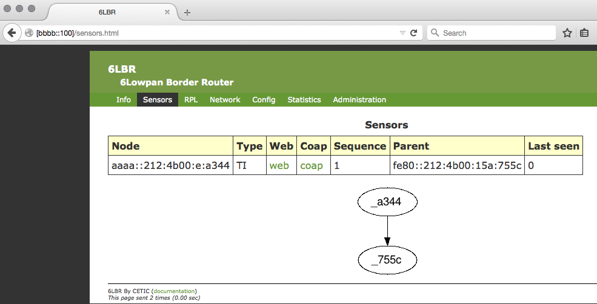
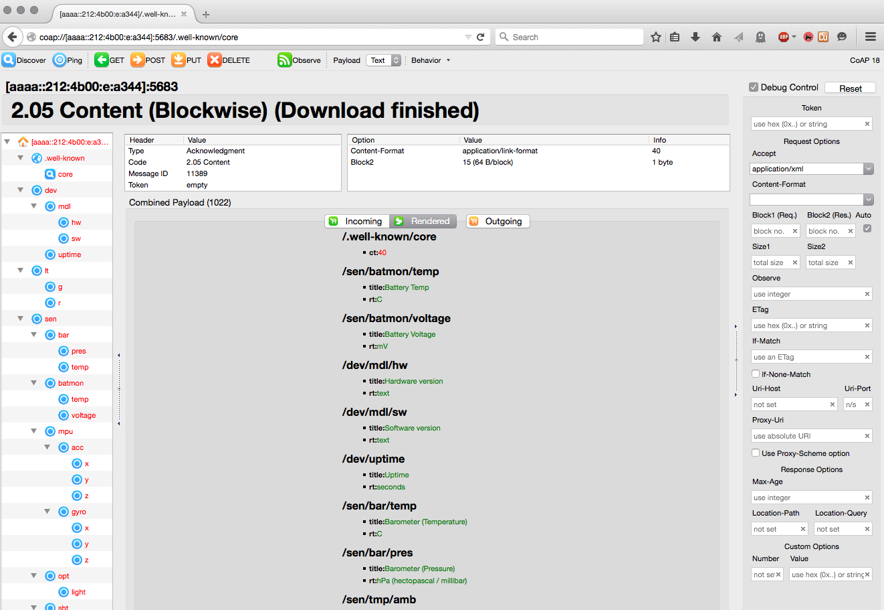
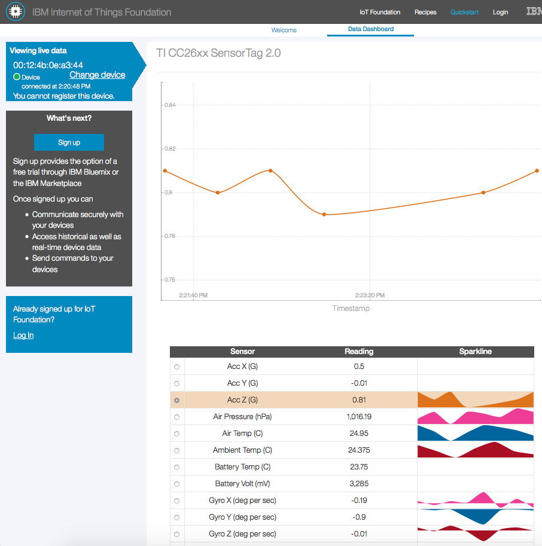
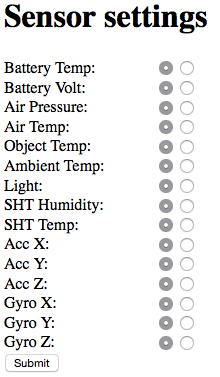

CC26xx Web Demo Readme
======================
This demo project combines a number of web-based applications aiming to
demonstrate the CC26xx capability. The applications are:

* A network-based UART
* A client for [6lbr](http://cetic.github.io/6lbr/)
* A CoAP server
* An MQTT client
* A web server which can be used to display sensor readings but also to
  configure MQTT functionality

The example has been configured to run for both CC26xx-based boards: i) The
SensorTag 2.0 and ii) The Srf06EB with a CC26xx EM mounted on it.

To build the example for the Srf, simply run `make`. To build for the tag,
run `make BOARD=sensortag`. Do not forget to `make clean` when switching
between the two platforms.

You can disable some of those individual components by changing the respective
defines in `project-conf.h`. For instance, to disable the CoAP functionality,
set `#define CC26XX_WEB_DEMO_CONF_COAP_SERVER 0`. The web server cannot be
disabled, all other aforementioned applications can.

Network UART (net-uart)
-----------------------
This example only makes sense if you are using the Srf or if you have taken
the sensortag out of its case and you have it connected over JTAG to the Srf.

The net-uart does two things:

* When you type a string to the UART console, the string will be sent verbatim
  to a remote UDP port 7777 listener. This can be for example a netcat listener
  on a linux or OS X PC:
  `nc -6ulkw 1 7777`
* The net-uart also listens to UDP port 7777 and when it receives a string over
  UDP, it will print it verbatim over UART.

The example will initially send packets to a hard-coded IPv6 address. This can
be changed very easily by entering a different IPv6 address to the console.
Thus, when the serial input string is an IPv6 address, it will not be sent as
any other string would, but instead it will configure the example to send to a
different remote address. This new IPv6 address is not persistent across
device reboots.

6lbr Client
-----------
This will periodically send a UDP packet to your 6lbr, containing network
information, which will be used by 6lbr to construct a network graph. To see
this in action, fire up a browser and navigate to the 6lbr web page. The
default address is http://[bbbb::100]. Once the page loads, click the 'sensors'
tab, as per the image below.

CoAP Server
-----------
For this functionality to work, you will need to install the
[Copper (Cu)](https://addons.mozilla.org/en-US/firefox/addon/copper-270430/)
addon to your browser.

From the sensors tab in the 6lbr web page, click the 'coap' link in the line
corresponding to your CC26xx device. Once the addon fires up, select
".well-known/core" in the left pane and then hit the 'Get' button at the top.

The Device will respond with a list of all available CoAP resources. This list
will be different between the Srf and the SensorTag. The screenshot below shows
a (partial) list of resources exported by the SensorTag CoAP server. Select
a resource on the left pane and hit 'Get' to retrieve its value. Select
`lt/g` and hit 'Post' to toggle the green LED, `lt/r` for the red one.

You can also use CoAP to enable/disable BLE advertisements! Select
`dev/ble_advd` and then hit the "Outgoing" button in the payload panel. Type in
the desired payload, which can be:

* `mode=on|off`
* `name=<name>`
* `interval=<secs>`

or a combination of both delimited with an amp. For example, you can set as
payload `mode=on&name=My CC26xx Device 4&interval=5`. Once you have set the
payload, hit either the POST or PUT button.

Bear in mind that you must set `name` at least once before enabling BLE
advertisements. If you fail to do so, the RF will refuse to enter BLE mode and
the CoAP engine will return 4.03 forbidden. The values of `name` and `interval`
persist across BLE on/off cycles, so you only have to set them once. The values
do _not_ persist through device powercycles.

HTTPD
-----
Back on the 6lbr page, hit the 'web' link corresponding to your device. This
will take you to a web page served by the CC26xx. The HTTPD serves two pages:

* index.html: Provides sensor readings and network information
* config.html: Can be used to configure the MQTT client (more below)

In the navigation bar at the top there is also a third link, which will take
you directly to your device's page on IBM's quickstart service.

IBM Quickstart / MQTT Client
----------------------------
The MQTT client can be used to:

* Publish sensor readings to an MQTT broker.
* Subscribe to a topic and as a result receive commands from an MQTT broker

The device will try to connect to IBM's quickstart over NAT64, so you will
need a NAT64 gateway in your network to make this work. A guide on how to
setup NAT64 is out of scope here. If this is not an option for you, you can
configure the device to publish to a local MQTT broker over end-to-end IPv6.
See below on how to change the destination broker's address.

By default the device will publish readings to IBM's quickstart service. The
publish messages include sensor readings but also some other information such
as device uptime in seconds and a message sequence number. Click the "IBM
Quickstart" link in the web page to go directly to your device's page
on Quickstart. After a few seconds, you will see something like this:

Sensor readings are only published if they have changed since the previous
reading (BatMon is an exception and always gets published). Additionally, you
can turn on/off individual readings from the config.html web page, as per the
figure below.

Some of the MQTT client functionality can be configured even further:

* You can change the broker IP and port. This is useful if you want to use your
  own MQTT broker instead of IBM's quickstart. The example has been tested
  successfully with [mosquitto](http://mosquitto.org/)
* You can change the publish interval. Recommended values are 10secs or higher.
  You will not be allowed to set this to anything less than 5 seconds.
* If you want to use IBM's cloud service with a registered device, change
  'Org ID' and provide an 'Auth Token', which acts as a 'password', but bear in
  mind that it gets transported in clear text, both over the web configuration
  page as well as inside MQTT messages.
* The remaining configuration options are related to the content of MQTT
  messages and in general you won't have to modify them.

For the SensorTag, changes to the MQTT configuration get saved in external
flash and persist across device restarts. The same does not hold true for
Srf+EM builds.

You can also subscribe to topics and receive commands, but this will only
work if you use "Org ID" != 'quickstart'. Thus, if you provide a different
Org ID (do not forget the auth token!), the device will subscribe to:

`iot-2/cmd/+/fmt/json`

You can then use this to toggle LEDs or to turn the buzzer on and off.
The buzzer is only available on the SensorTag. To do this, you can for example
use mosquitto client to publish to `iot-2/cmd/leds/fmt/json`. So, to turn
the buzzer on, you would do this:

`mosquitto_pub -h <broker IP> -m "1" -t iot-2/cmd/buzz/fmt/json`

Where `broker IP` should be replaced with the IP address of your mosquitto
broker (the one where you device has subscribed). Replace `-m "1'` with `-m "0"`
to turn the buzzer back off. Replace `buzz` with `leds` in the topic to change
the state of the LED.

Bear in mind that, even though the topic suggests that messages are of json
format, they are in fact not. This was done in order to avoid linking a json
parser into the firmware.
