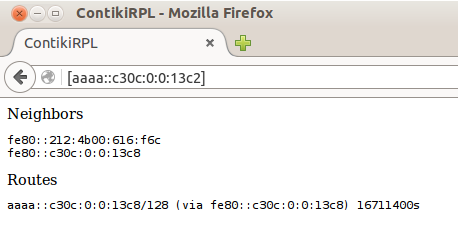

# Border Router example

The following example shows how to create and deploy a Border Router, an edge device sitting between an IP network and our 6LoWPAN wireless network.

To compile and flash the example run the following command:

````
make border-router.upload && make connect-router
````

Note the default `TARGET` is set to `Z1` in the `Makefile.target` file, to use a `zoul` based platform instead just override as shown in the lesson before.

````
using saved target 'z1'
sudo ../../../../../tools/tunslip6 aaaa::1/64
[sudo] password for zolertia: 
********SLIP started on ``/dev/ttyUSB0''
opened tun device ``/dev/tun0''
ifconfig tun0 inet `hostname` mtu 1500 up
ifconfig tun0 add aaaa::1/64
ifconfig tun0 add fe80::0:0:0:1/64
ifconfig tun0

tun0      Link encap:UNSPEC  HWaddr 00-00-00-00-00-00-00-00-00-00-00-00-00-00-00-00
          inet addr:127.0.1.1  P-t-P:127.0.1.1  Mask:255.255.255.255
          inet6 addr: fe80::1/64 Scope:Link
          inet6 addr: aaaa::1/64 Scope:Global
          UP POINTOPOINT RUNNING NOARP MULTICAST  MTU:1500  Metric:1
          RX packets:0 errors:0 dropped:0 overruns:0 frame:0
          TX packets:0 errors:0 dropped:0 overruns:0 carrier:0
          collisions:0 txqueuelen:500 
          RX bytes:0 (0.0 B)  TX bytes:0 (0.0 B)

*** Address:aaaa::1 => aaaa:0000:0000:0000
Got configuration message of type P
Setting prefix aaaa::
Server IPv6 addresses:
 aaaa::c30c:0:0:13c2
 fe80::c30c:0:0:13c2
````

The `make connect-router` by default will execute `tunslip6`, a script that creates a virtual tunnel interface in our host, and forwards IP packets through the USB port of the `Z1` and `RE-Mote`.  The default `IPv6 prefix` used is `aaaa::/64` and the tunnel interface itself will have the address `aaaa::1`.  To use a different prefix use as follows:

````
make connect-router PREFIX="abcd:beef::100/64"
````

In this case we will use `abcd:beef` as our IPv6 prefix (used to create the device's IPv6 addresses with SLAC), and the tunnel interface will have the address `abcd:beef::100`.

If the Zolertia device is connected in a port different than `/dev/ttyUSB0`, you can also use the following:

````
make connect-router PREFIX="-s /dev/ttyUSB1 -t tun08 abcd:beef::100/64"
````

This will create for this particular case a `tunslip6` connection over `/dev/ttyUSB1` USB port, and will name the tunnel interface as `tun08`, handy if there is any other named-alike interface.

Note the examples above used a local IPv6 prefix, only valid locally and not routable unless we add routes to it or advertise.  If you have a global and public IPv6 prefix, you can use as well and your 6LoWPAN network will be connected to Internet.

## Check our connection

From a host we should be able to `ping6` both our tunnel interface address and the address of the `Border Router` device, in this case the `Z1` or the `RE-Mote` IPv6 address configured using the assigned `IPv6 prefix` over `tunslip6` and its own MAC address:

````
$ ping6 aaaa::c30c:0:0:13c2
PING aaaa::c30c:0:0:13c2(aaaa::c30c:0:0:13c2) 56 data bytes
64 bytes from aaaa::c30c:0:0:13c2: icmp_seq=1 ttl=64 time=19.8 ms
64 bytes from aaaa::c30c:0:0:13c2: icmp_seq=2 ttl=64 time=20.3 ms
64 bytes from aaaa::c30c:0:0:13c2: icmp_seq=3 ttl=64 time=20.5 ms
64 bytes from aaaa::c30c:0:0:13c2: icmp_seq=4 ttl=64 time=20.8 ms
64 bytes from aaaa::c30c:0:0:13c2: icmp_seq=5 ttl=64 time=20.6 ms
64 bytes from aaaa::c30c:0:0:13c2: icmp_seq=6 ttl=64 time=20.6 ms
````

If we use a Global IPv6 prefix, that is, one accessible over Internet, we can even ping our device from anywhere in the world.


## Border Router webserver

If you open a web browser (Firefox for example) and enter the Border Router address it will display information about the devices in the Border Router's 6LoWPAN network, such as addresses and default routes.


