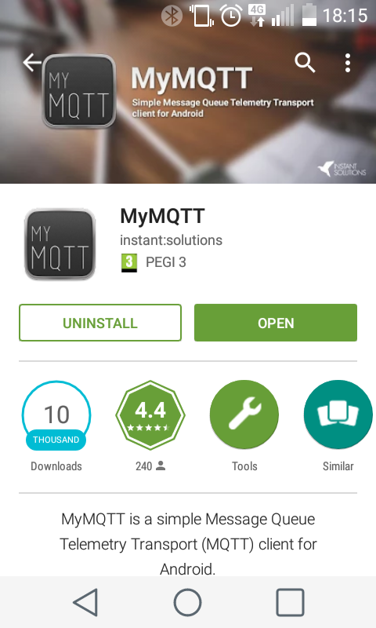

# UDP client and server example

The following example shows how to send sensor information to an UDP server running on the host network, even on a different network over Internet.

The UDP server is implemented in a python script, it allows to forward data also to other services.

The UDP server will send data to the MQTT broker of the Eclipse IoT foundation (at `iot.eclipse.org`), or to IFTTT (`ifttt.com`) to easily configure different types of events using a HTTP message as trigger.

Depending on the device the UDP client runs (`Z1` or `RE-Mote`), you need to adjust in the `UDP-MQTT-server.py` or `UDP-IFTTT-server.py` the following:

````
EXAMPLE_WITH_Z1 = 1
````

This example is the easiest way if you want to send data to a service or server outside your network, and you don't have an IPv6 network on your own.  The Border Router as seen before can use a local `IPv6 prefix` and then the UDP server running on the host can forward to anywhere and anyone.

## Requirements

This example requires at least two Zolertia devices: A Border Router and an UDP client.

You can use alternatively `Z1` and `RE-Motes` as both can interoperate with each other.

You will also need to install the following python library if using the MQTT forwarder:

````
pip install paho-mqtt
````

You will need at least two Zolertia motes, the `RE-Mote` and `Z1` can be used together in the same network.

## Program the devices

First flash a device as a Border Router, check the [previous example](../02-border-router)

Then flash another device as the UDP client:

````
make 03-udp-client.upload
````

If you are compiling for the `Z1` target this is the expected output:

````
Node id is not set, using Z1 product ID
Rime started with address 193.12.0.0.0.0.19.200
MAC c1:0c:00:00:00:00:13:c8 Ref ID: 5064
Contiki-3.x-2162-g709d3d5 started. Node id is set to 5064.
CSMA nullrdc, channel check rate 128 Hz, radio channel 26
Tentative link-local IPv6 address fe80:0000:0000:0000:c30c:0000:0000:13c8
Starting 'UDP client example process'
UDP client process started
Server address: fd00::1
Client IPv6 addresses:
fe80::c30c:0:0:13c8

Created a connection with the server :: local/remote port 8765/5678

ID: 171, temp: 2412, x: -211, y: 137, z: -95, batt: 2989, counter: 1
Send readings to 1'
ID: 171, temp: 2412, x: -212, y: 138, z: -94, batt: 2989, counter: 2
Send readings to 1'
ID: 171, temp: 2412, x: -216, y: 138, z: -93, batt: 2990, counter: 3
Send readings to 1'
````

## Verify the connection

As usual you can `ping6` the `tunslip6` interface and the Border Router address, also you can ping the UDP client node.

In the Border Router webserver check the UDP client's address:


Then ping:

````
$ ping6 fd00::c30c:0:0:13c8
PING fd00::c30c:0:0:13c8(fd00::c30c:0:0:13c8) 56 data bytes
64 bytes from fd00::c30c:0:0:13c8: icmp_seq=1 ttl=63 time=35.4 ms
64 bytes from fd00::c30c:0:0:13c8: icmp_seq=2 ttl=63 time=60.2 ms
64 bytes from fd00::c30c:0:0:13c8: icmp_seq=3 ttl=63 time=35.4 ms
64 bytes from fd00::c30c:0:0:13c8: icmp_seq=4 ttl=63 time=35.2 ms
````

## Launch the UDP server and MQTT forwarder

To use the UDP server forwarding data to the Eclipse IoT MQTT broker:

````
$ python UDP-MQTT-server.py 
UDP6 server side application V0.1
Started 2016-02-26 09:23:49.673940
UDP server ready: 5678
msg structure size:  13

MQTT: Connected (0) 
2016-02-26 09:23:58 -> fd00::c30c:0:0:13c8:8765 14
{
  "values": [
    {
      "value": 171, 
      "key": "id"
    }, 
    {
      "value": 0, 
      "key": "counter"
    }, 
    {
      "value": 2320, 
      "key": "temperature"
    }, 
    {
      "value": -135, 
      "key": "x_axis"
    }, 
    {
      "value": 40, 
      "key": "y_axis"
    }, 
    {
      "value": -120, 
      "key": "z_axis"
    }, 
    {
      "value": 2981, 
      "key": "battery"
    }
  ]
}
MQTT: Publishing to {0}... 0 (171)
Sending reply to fd00::c30c:0:0:13c8
MQTT: Published 2
````

Alternatively we can run in parallel the `mqtt-client.py` python script and subscribe to the `v2/zolertia/tutorialthings/#`.  Each time our UDP client sends a packet to the UDP server, we will receive a notification as the MQTT broker will notify us about the publication:

````
$ python mqtt-client.py 
connecting to iot.eclipse.org
Connected with result code 0
Subscribed to v2/zolertia/tutorialthings/#
v2/zolertia/tutorialthings/171 {"values":[{"key": "id", "value": 171},{"key": "counter", "value": 0},{"key": "temperature", "value": 2326},{"key": "x_axis", "value": -129},{"key": "y_axis", "value": 38},{"key": "z_axis", "value": -122},{"key": "battery", "value": 2987}]}
````

Optionally if you are using an Android phone, you can download the `MyMQTT` application and receive the notifications in your phone:



The connection details are:

````
Server : "iot.eclipse.org"
Port   : 1883
Username/password not required
````

The `UDP-MQTT-server.py` by default publishes to the following topic:

````
MQTT_URL_PUB      = "v2/zolertia/tutorialthings/"
````

Using the node's `ID` message field to construct the topic as follows

````
v2/zolertia/tutorialthings/ID
````

You can change this and use whatever you prefer.

## Launch the UDP server and IFTTT forwarder

Create an IFTTT account and subscribe to the [Maker Channel](https://ifttt.com/maker):


And copy your `Key`, that's it!


Then create the [Recipe](https://ifttt.com/myrecipes/personal) you want, for example to automatically create a calendar entry to the maintenance crew if the battery level is critical or the temperature of the room is too high, send an email whenever someones pushes the button, etc... you have plenty of channels to choose!


In the `UDP-IFTTT-server.py` just replace:

````
IFTTT_EVENT       = "test"
IFTTT_KEY         = ""
````

And that's it!
