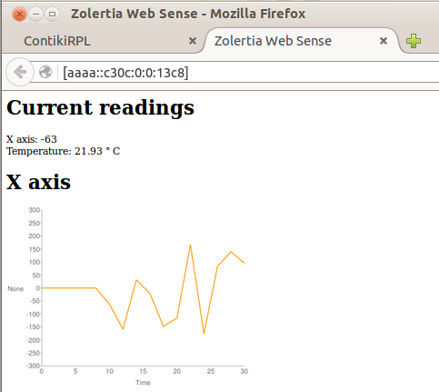
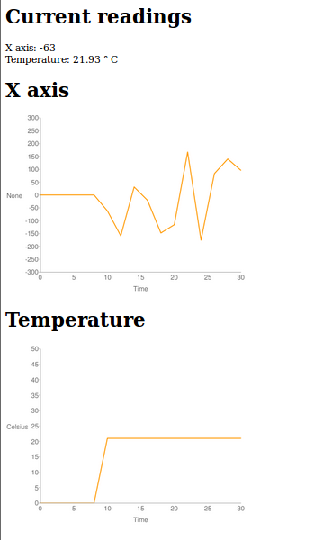

# Webserver example

This example shows how to implement a webserver on a `Z1` device.  The `zoul`
target is currently broken.

## Requirements

You will need at least two Zolertia devices: a Border Router and the webserver node.

Currently this example is only available for the `Z1` nodes as webservers.

## Program the devices

First flash a device as a Border Router, check the [previous example](../02-border-router)

Then as done before:

````
make zolertia-websense.upload
````

You will see the following output:

````
Node id is not set, using Z1 product ID
Rime started with address 193.12.0.0.0.0.19.200
MAC c1:0c:00:00:00:00:13:c8 Ref ID: 5064
Contiki-3.x-2162-gc68c791 started. Node id is set to 5064.
CSMA nullrdc, channel check rate 128 Hz, radio channel 26
Tentative link-local IPv6 address fe80:0000:0000:0000:c30c:0000:0000:13c8
Starting 'Z1 Sense Web Demo'
Node id is not set, using Z1 product ID
Rime started with address 193.12.0.0.0.0.19.200
MAC c1:0c:00:00:00:00:13:c8 Ref ID: 5064
Contiki-3.x-2162-gc68c791 started. Node id is set to 5064.
CSMA nullrdc, channel check rate 128 Hz, radio channel 26
Tentative link-local IPv6 address fe80:0000:0000:0000:c30c:0000:0000:13c8
Starting 'Z1 Sense Web Demo'
````

## Accesing the Webserver

Just open a browser and enter the webserver address:



The `Z1` on-board accelerometer X axis, the temperature and the battery level are displayed:


