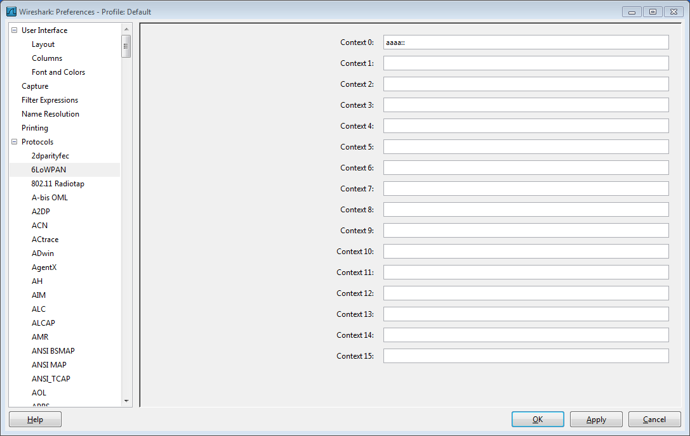
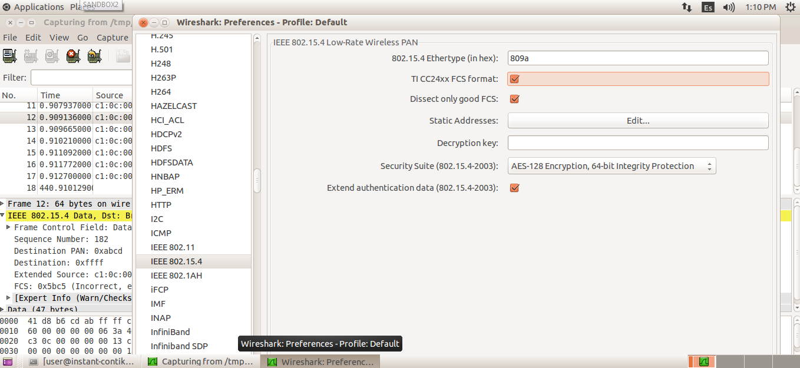

# 6LoWPAN Sniffer

A packet sniffer is a must-have tool for any wireless network application, it allows to see what you are transmitting over the air, verifying both that the transmissions are taking place, the frames/packets are properly formatted, and that the communication is happening on a given channel.

We will use for this exercise the [SenSniff](https://github.com/g-oikonomou/sensniff) application, paired with a `RE-Mote` or `Z1` node and Wireshark. This setup will allow us to understand how the wireless communication is done in Contiki.

## Requirements

At least one Zolertia device, either a `RE-Mote` or a `Z1` node.

## Setup

To change the 6LoWPAN context:

````
core/net/ipv6/sicslowpan.c
````

Also overridable by:

````
#define SICSLOWPAN_CONF_ADDR_CONTEXT_0 { addr_contexts[0].prefix[0]=0xbb; addr_contexts[0].prefix[1]=0xbb; }
````

## Run sensniff

The `Z1` node has a different baudrate respect to the `RE-Mote`, to execute `sensniff` using the `Z1` as sniffer:

````
python sensniff.py --non-interactive -d /dev/ttyUSB0 -b 115200 -p test.pcap
````

To use with the `RE-Mote`:

````
python sensniff.py --non-interactive -d /dev/ttyUSB0 -b 460800 -p test.pcap
````

The `-p test.pcap` argument will save the capture in a file named `test.pcap`.

## Run wireshark

Launch wireshark from command line as below:

````
sudo wireshark -i /tmp/sensniff
````

In wireshark configure the 6LoWPAN context accordingly to the configuration in Contiki:



Also configure the TI frame:


