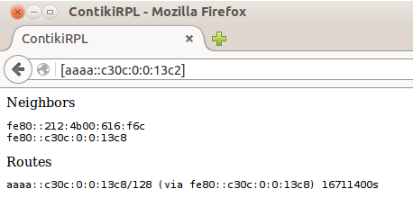
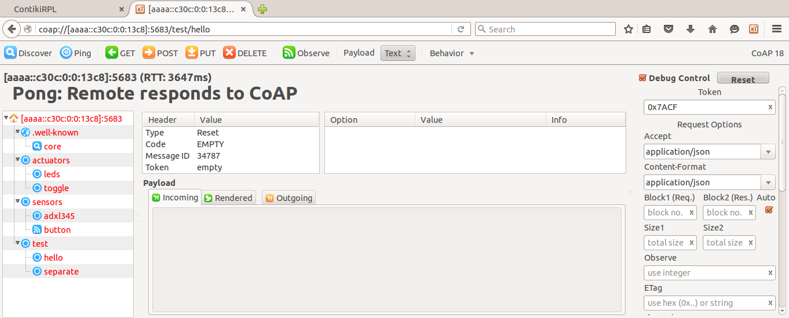
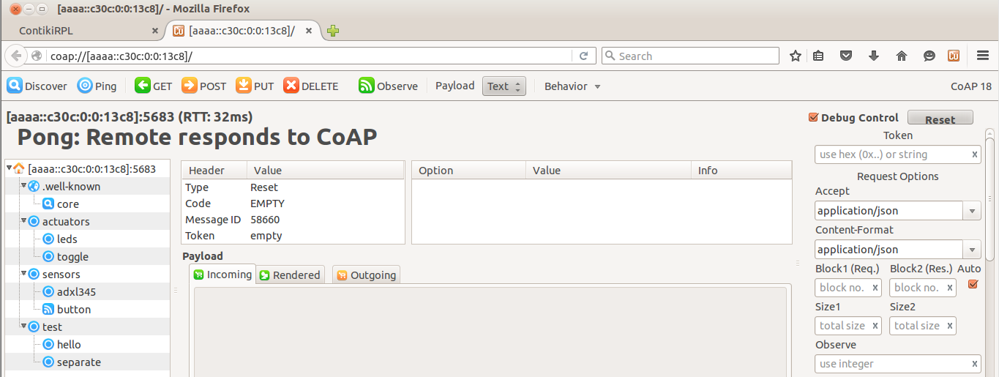
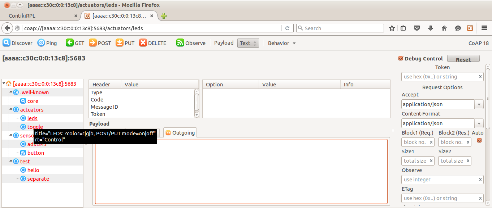
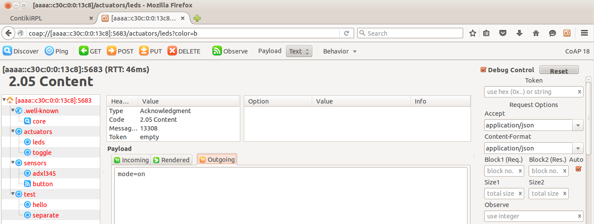
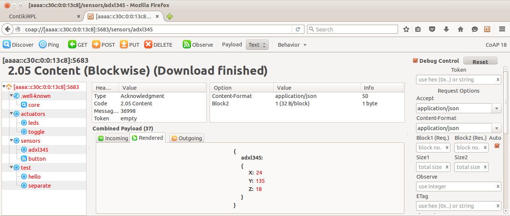

# Lesson 3: Create a CoAP server

The following examples will show how to create an embedded CoAP server.

CoAP - the Constrained Application Protocol - is a specialized web transfer protocol for use with constrained nodes and constrained networks in the Internet of Things.

For more information about CoAP visit the following page:

http://coap.technology


## Lesson objectives

The objective of the lessons are:

* Learn how to create a CoAP resource and build a CoAP server
* Show how to use the Copper client plugin to interact with our CoAP server
* Learn how to discover the resources our CoAP server exposes
* Learn how to use the `GET` method to retrieve sensor data from the CoAP server
* Subscribe to events (be notified each time the user button is pushed)
* Request sensor readings in different formatting (application/json, text/plain, etc)
* Control the on-board LEDs remotely using `PUT/POST` requests


## Requirements

We assume you have a working Contiki development environment, if you need help configuring the toolchain and others, please visit this page:

https://github.com/Zolertia/Resources/wiki

For this lesson `Firefox` browser is required, as we need the following plugin to be installed:

https://addons.mozilla.org/en-US/firefox/addon/copper-270430/

You will also need two Zolertia devices: a Border Router and a node acting as a CoAP server.

This example works for both `Z1` nodes and `zoul` platforms like the `RE-Mote`, each one will expose its on-board sensors as a `resource`.

Keep in mind the `Z1` has lesser number of `resources` enabled due to RAM constrains.


## Instructions

### Set up a Border Router

Use the border router explained in `Lesson 2`.  Remember the `project-conf.h` settings MUST match the ones in our `project-conf.h`.  If you haven't change anything, both configurations should match already.

### Compile and program the CoAP server

````
make er-example-server.upload
````

### Check the CoAP server is online and ready

We have to ways to assert this, one is browsing the `Border Router webserver` and see if the CoAP server is on the neighbors list.




And do a ping request to check is indeed online:

````
$ ping6 aaaa::c30c:0:0:13c8
PING aaaa::c30c:0:0:13c8(aaaa::c30c:0:0:13c8) 56 data bytes
64 bytes from aaaa::c30c:0:0:13c8: icmp_seq=1 ttl=63 time=34.9 ms
64 bytes from aaaa::c30c:0:0:13c8: icmp_seq=2 ttl=63 time=34.9 ms
64 bytes from aaaa::c30c:0:0:13c8: icmp_seq=3 ttl=63 time=34.7 ms
64 bytes from aaaa::c30c:0:0:13c8: icmp_seq=4 ttl=63 time=35.0 ms
^C
--- aaaa::c30c:0:0:13c8 ping statistics ---
4 packets transmitted, 4 received, 0% packet loss, time 3006ms
rtt min/avg/max/mdev = 34.734/34.910/35.023/0.216 ms
````

The second one is using the `Copper` client and do a CoAP ping:




### Discovering the CoAP server resources

Click on the `Discover` button to request the available resources of the CoAP server.




### Interact with the on-board LEDs

If you hover your mouse on top of the `actuators/leds` resource, it will show the available commands and sintaxis.



The `actuators/leds` resource allows to change the operation mode of any LED.  Select the LED (red `r`, green `g` or blue `b`) as follows:

````
coap://[...]:5683/actuators/leds?color=r
````

Then in the `Payload` window, on the `Outgoing` tab write the operation `mode` either `on` or `off`:

````
mode=on
````

And click on the `POST` or `PUT` button:




### Read the ADXL345 accelerometer sensor (Z1 only)

Click on the `sensors/adxl345` resource and press the `GET` button:



Notice this returns the sensors values in JSON format, to retrieve the readings in `text/plain` instead change the `Accept` and `Content-Format` fields in the `Request Options` (on the right side of the browser).

### Read the Zoul on-board sensors (RE-Mote only)

Click on the `sensors/zoul` resource and press the `GET` button:

Notice this returns the sensors values in JSON format, to retrieve the readings in `text/plain` instead change the `Accept` and `Content-Format` fields in the `Request Options` (on the right side of the browser).

### Observe button events 

By clicking on the `sensors/button` resource and hitting the `OBSERVE` button, we will `subscribe` to the button, and each time the button is pressed, we will receive a notification.
